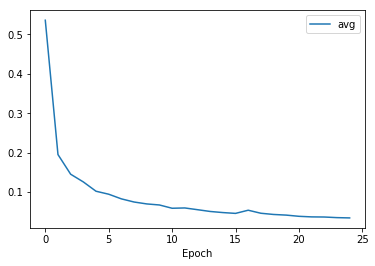

# Semantic Segmentation
### Introduction
In this project, you'll label the pixels of a road in images using a Fully Convolutional Network (FCN).

### Setup
##### GPU
`main.py` will check to make sure you are using GPU - if you don't have a GPU on your system, you can use AWS or another cloud computing platform.
##### Frameworks and Packages
Make sure you have the following is installed:
 - [Python 3](https://www.python.org/)
 - [TensorFlow](https://www.tensorflow.org/)
 - [NumPy](http://www.numpy.org/)
 - [SciPy](https://www.scipy.org/)

You may also need [Python Image Library (PIL)](https://pillow.readthedocs.io/) for SciPy's `imresize` function.

##### Dataset
Download the [Kitti Road dataset](http://www.cvlibs.net/datasets/kitti/eval_road.php) from [here](http://www.cvlibs.net/download.php?file=data_road.zip).  Extract the dataset in the `data` folder.  This will create the folder `data_road` with all the training a test images.

##### Run
Run the following command to run the project:
```
python main.py
```
### Results

I run 2 tryouts with the following parameters:  
- Epochs = 25
- Batch Size = 5
- Dropout = [ 0.75, 0.5 ]

It seems tryout with dropout = 0.75 provided better results.  

##### Dropout = 0.75 Samples


##### Dropout = 0.5 Samples


##### Dropout = 0.75 Average loss for 25 epochs plot 


Also I implemented augmentation with: 
- Flipping
- Random Hue, Saturation and Brightness change
